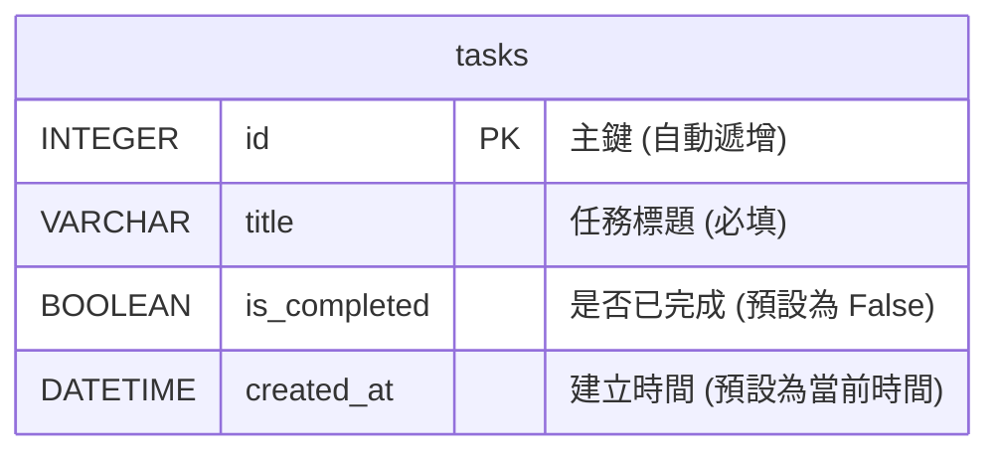

# 資料庫設計文件 (Database Design)

## 專案名稱：任務管理系統 (Task Management System)

本專案使用 SQLite 作為資料庫系統，並透過 Flask-SQLAlchemy (ORM) 來管理與存取資料。本文件定義了資料庫的實體關係圖 (ERD)、資料表欄位詳情以及對應的 SQL 建表語法。

---

## 1. ER 圖（實體關係圖）

由於任務管理系統為個人日常工作設計，核心結構為單一任務的記錄。下圖展示了任務 (`tasks`) 資料表的結構：



---

## 2. 資料表詳細說明

### 資料表名稱：`tasks` (任務表)

儲存使用者新增的待辦任務資料。

| 欄位名稱 (Column) | 資料型態 (Type) | 鍵值 (Key) | 必填 (Nullable) | 預設值 (Default) | 說明 (Description) |
| :--- | :--- | :--- | :--- | :--- | :--- |
| `id` | `INTEGER` | PK | NOT NULL | *(自動遞增)* | 任務的唯一識別碼 |
| `title` | `VARCHAR(100)` | - | NOT NULL | - | 任務標題/內容（不可為空） |
| `is_completed` | `BOOLEAN` | - | NOT NULL | `False` (0) | 任務完成狀態（`True` 為已完成，`False` 為未完成） |
| `created_at` | `DATETIME` | - | NOT NULL | `CURRENT_TIMESTAMP` | 任務建立的日期與時間 |

---

## 3. SQL 建表語法 (SQLite)

以下為本專案的 SQLite DDL 建表語法，儲存於 `database/schema.sql` 檔案中：

```sql
-- 建立 tasks 資料表
CREATE TABLE IF NOT EXISTS tasks (
    id INTEGER PRIMARY KEY AUTOINCREMENT,
    title VARCHAR(100) NOT NULL,
    is_completed BOOLEAN NOT NULL DEFAULT 0,
    created_at DATETIME NOT NULL DEFAULT CURRENT_TIMESTAMP
);
```

---

## 4. Python Model 實作架構

在 Flask 專案中，我們使用 Flask-SQLAlchemy 作為 ORM 框架，對應之 Model 定義於 `app/models/task.py`。
Model 中除了欄位定義外，亦封裝了常用的 **CRUD** 靜態方法與實例方法，以便在路由控制器 (Routes) 中直接呼叫。

### CRUD 方法設計說明
*   **Create (新增)**：`Task.create(title)`
*   **Read (讀取)**：
    *   取得所有/篩選任務：`Task.get_all(status=None)` (支援 `all`, `pending`, `completed` 篩選)
    *   依 ID 取得單一任務：`Task.get_by_id(task_id)`
*   **Update (更新)**：`task.update(title=None, is_completed=None)`
*   **Delete (刪除)**：`task.delete()`
