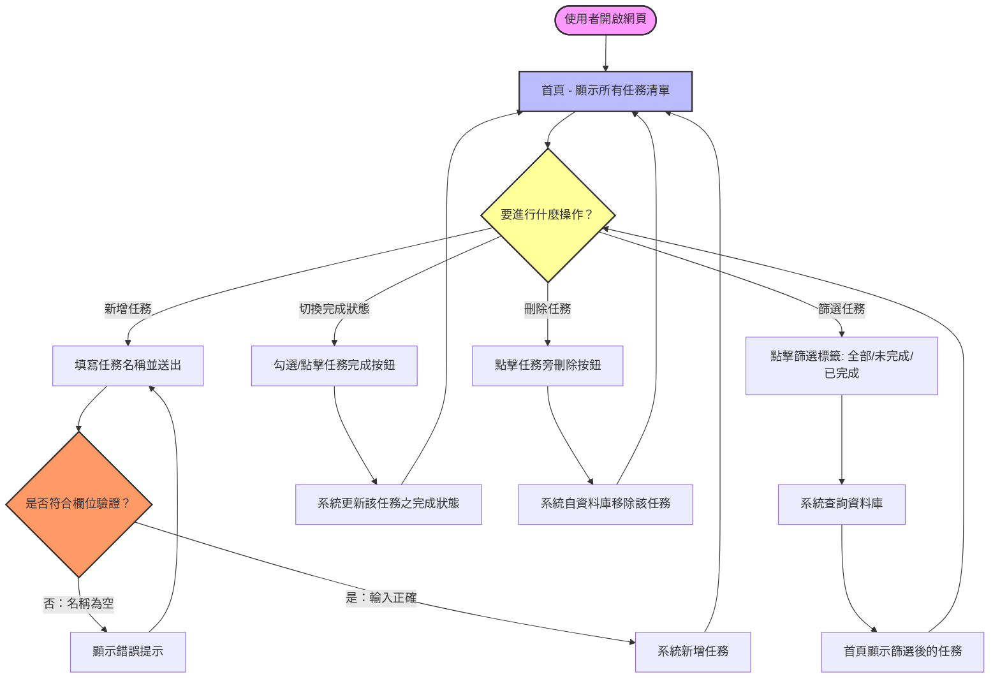

# 系統流程圖與序列圖設計文件 (System Flowcharts & Diagrams)

## 專案名稱：任務管理系統 (Task Management System)

本文件使用 Mermaid 語法繪製系統流程圖，藉此視覺化使用者的操作路徑與系統內部的資料流向，協助開發團隊理解功能間的先後邏輯與互動流程。

---

## 1. 使用者流程圖 (User Flow)

下圖展示個人用戶開啟系統後的完整操作動線，涵蓋新增任務、切換篩選狀態、標記完成以及刪除任務等路徑。



---

## 2. 系統序列圖 (Sequence Diagrams)

以下序列圖展示了前端瀏覽器 (Browser)、後端 Flask 路由控制器 (Route)、SQLAlchemy 模型 (Model) 與 SQLite 資料庫 (Database) 之間的互動流程。

### 情境 A：瀏覽與篩選任務列表

當使用者開啟首頁或切換不同篩選狀態（如：僅看未完成任務）時的運作邏輯：

```mermaid
sequenceDiagram
    actor User as 使用者
    participant Browser as 瀏覽器
    participant Route as Flask 路由 (task_routes.py)
    participant Model as Task Model (task.py)
    database DB as SQLite (database.db)

    User->>Browser: 開啟網頁或點擊篩選標籤
    Note over Browser: URL 可能為 /?status=pending
    Browser->>Route: 發送 GET /?status=pending 請求
    Route->>Route: 讀取查詢參數 status = 'pending'
    Route->>Model: 查詢 is_completed 為 False 的任務
    Model->>DB: 執行 SELECT * FROM tasks WHERE is_completed = 0
    DB-->>Model: 回傳任務資料集
    Model-->>Route: 回傳任務物件清單
    Route->>Route: 呼叫 render_template("index.html", tasks=tasks)
    Route-->>Browser: 回傳已渲染的 HTML 頁面
    Browser-->>User: 呈現篩選後的任務清單
```

### 情境 B：新增一筆待辦任務

當使用者輸入任務名稱並點擊新增時的運作邏輯：

```mermaid
sequenceDiagram
    actor User as 使用者
    participant Browser as 瀏覽器
    participant Route as Flask 路由 (task_routes.py)
    participant Model as Task Model (task.py)
    database DB as SQLite (database.db)

    User->>Browser: 於輸入框輸入任務名稱並點擊「新增」
    Browser->>Route: 發送 POST /tasks/add 請求 (附帶 form data: title)
    Route->>Route: 驗證 title 是否為空或超出字數限制
    alt 驗證失敗 (空白字串)
        Route-->>Browser: 回傳錯誤訊息 / 快閃訊息 (Flash Message)
        Browser-->>User: 顯示提示「任務名稱不可為空」
    else 驗證成功
        Route->>Model: 建立新 Task 實例 (title, is_completed=False)
        Model->>DB: 執行 INSERT INTO tasks ...
        DB-->>Model: 寫入成功
        Model-->>Route: 回傳確認
        Route-->>Browser: 發送 302 重導向 (Redirect to /)
        Browser->>Route: 重新發送 GET / 請求 (更新列表)
        Route-->>Browser: 回傳最新任務列表 HTML
        Browser-->>User: 呈現包含新任務的清單
    end
```

### 情境 C：切換任務完成狀態 (Toggle) 與刪除任務

當使用者標記完成或刪除任務時的運作邏輯：

```mermaid
sequenceDiagram
    actor User as 使用者
    participant Browser as 瀏覽器
    participant Route as Flask 路由 (task_routes.py)
    participant Model as Task Model (task.py)
    database DB as SQLite (database.db)

    %% 標記完成
    User->>Browser: 點擊任務完成按鈕
    Browser->>Route: 發送 POST /tasks/<id>/toggle 請求
    Route->>Model: 依據 <id> 查詢任務
    Model->>DB: 執行 SELECT ...
    DB-->>Model: 回傳任務資料
    Route->>Route: 將 is_completed 取反 (True <-> False)
    Route->>Model: 儲存變更
    Model->>DB: 執行 UPDATE tasks SET is_completed = ... WHERE id = ...
    DB-->>Model: 更新成功
    Route-->>Browser: 重導向至 / (Redirect)
    Browser-->>User: 畫面更新，任務顯示為已完成 (文字刪除線)

    %% 刪除任務
    User->>Browser: 點擊任務旁「刪除」按鈕
    Browser->>Route: 發送 POST /tasks/<id>/delete 請求
    Route->>Model: 依據 <id> 刪除任務
    Model->>DB: 執行 DELETE FROM tasks WHERE id = <id>
    DB-->>Model: 刪除成功
    Route-->>Browser: 重導向至 / (Redirect)
    Browser-->>User: 畫面更新，任務已消失
```

---

## 3. 功能清單對照表

系統提供之所有 API 路由與對應功能之規格整理如下：

| 功能名稱 | 對應 URL | HTTP 方法 | 參數 | 說明 |
| :--- | :--- | :--- | :--- | :--- |
| **首頁與任務列表** | `/` | `GET` | `status` (Query string, 可選: `all`, `pending`, `completed`) | 顯示主畫面。若帶有 `status` 則回傳篩選後的任務，預設為 `all` |
| **新增任務** | `/tasks/add` | `POST` | `title` (表單資料) | 於資料庫建立一筆新的未完成任務，成功後重新導向至首頁 |
| **切換任務狀態** | `/tasks/<int:id>/toggle` | `POST` | `id` (路徑參數) | 將指定 ID 的任務完成狀態在已完成與未完成之間切換 |
| **刪除任務** | `/tasks/<int:id>/delete` | `POST` | `id` (路徑參數) | 自資料庫永久刪除指定 ID 的任務 |

> **設計說明**：狀態切換與刪除功能雖然通常在純 API 設計中會使用 `PUT`/`PATCH` 或 `DELETE`，但考量到**原生 HTML 檔案表單僅支援 `GET` 與 `POST`**，為了在不依賴大量前端 AJAX 框架的情況下維持純 HTML 的簡易性，所有寫入與刪除操作在路由設計上皆統一使用 **`POST`** 方法實作。
